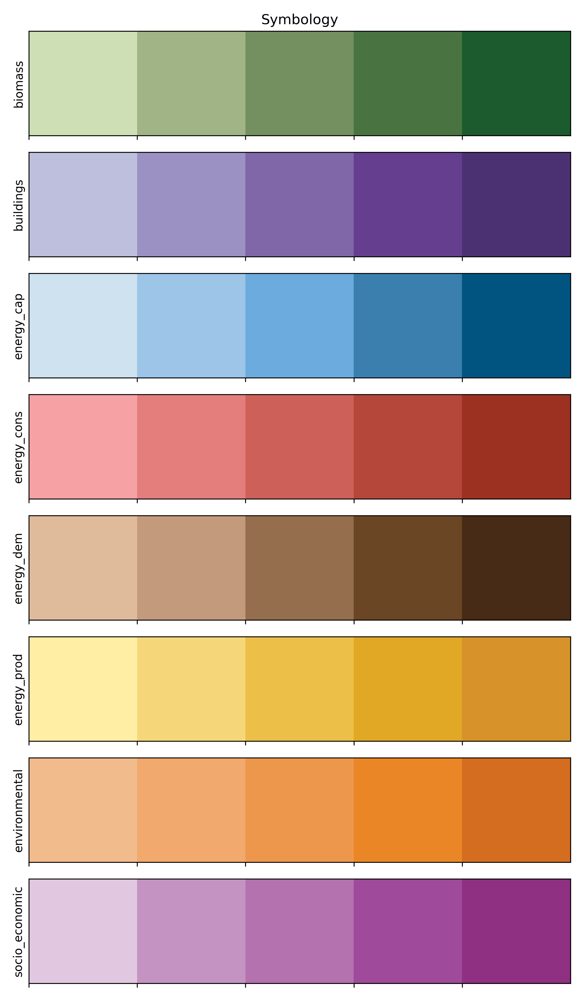

# Enermaps platform's symbology

In this repository is published the symbology of the layers available on the enermaps platform



## Description
The present repository provides two data sets:
* `data/layers.csv` contains the list of the layers;
* `data/color-table.csv` contains the list of colors.


## Repository structure

Files:
```
datapackage.json            Datapackage JSON file with the main meta-data
data/
    layers.csv              CSV data with the list and classification of the layers
    color-tables.csv        CSV data with the list of colors to be applied for each task
src/
    preview.py              Python code to read and generate the preview image
    preview.png             Generated image based on the value presents in `data/color-tables.csv`
    requirements.txt        Python packages required to generate the preview
    requirements-dev.txt    Python packages required to contribute
```

### How to generate and update the preview

Create a virtualenv:

```bash
$ python3 -m venv venv
```

Activate the virtualenv with:

```bash
$ source venv/bin/activate
```

To deactivate the virtualenv execute `deactivate`. You can read more on the [venv](https://docs.python.org/3/library/venv.html) from the python documentation.

Install the required python packages with:

```bash
$ python3 -m pip install -r src/requirements.txt
```

Finally update the `src/preview.png` file with:

```bash
$ python3 src/preview.py
```

### How to contribute on the code

Install on the `venv` the development packages with:

```bash
$ python3 -m pip install -r src/requirements-dev.txt
```

Then enable the [pre-commit](https://pre-commit.com/) hooks with:

```bash
$ venv/bin/pre-commit install
```

Before commit your work check that everything is fine with:

```bash
$ venv/bin/pre-commit run --all-files
```


## Authors

Valentina D'Alonzo, Samuele Zilio, Amy Segata


## Acknowledgement

We would like to convey our deepest appreciation to the Horizon 2020 [Enermaps Project](https://enermaps.eu/) (Grant Agreement number 884161), which provided the funding to carry out the present investigation.


## License

Copyright © 2016-2018: Valentina D'Alonzo <valentina.dalonzo@eurac.edu>

Creative Commons Attribution 4.0 International License
This work is licensed under a Creative Commons CC BY 4.0 International License.

SPDX-License-Identifier: CC-BY-4.0

License-Text: https://spdx.org/licenses/CC-BY-4.0.html
